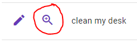

## If you dont have npm installed already, install nodejs

<p align="center">
Download the Windows Installer from NodeJs official website. Make sure you have downloaded the latest version of NodeJs. It includes the NPM package manager.
https://nodejs.org/en/download/

you can follow the following tutorial: https://radixweb.com/blog/installing-npm-and-nodejs-on-windows-and-mac
</p>

Once npm is installed you can open up a terminal, navigate to the cypress project and run the following command 

```bash
npm i
```


## What is Cypress?

<p align="center">
  <a href="https://player.vimeo.com/video/237527670">
    
  </a>
</p>

## Installing

[](https://badge.fury.io/js/cypress)

Install Cypress for Mac, Linux, or Windows, then [get started](https://on.cypress.io/install).

```bash
npm install cypress --save-dev
```
or
```bash
yarn add cypress --dev
```


To start the UI version of the cypress tests enter the following command. This will allow you to run a specific spec page, which should include multiple tests.

```bash
npx cypress open
```

If you prefer a quick check, it's better to run all tests in a headless mode. Headless mode still downloads all the html information yet does not render it on screen. This makes a significant difference in time. And is also how the tests will run in the pipeline, meaning that you should have the habit to run the headless tests before making the pr. 

Enter the following command 
```bash
npx cypress run 
```

## Exercise

Ik heb al enkele testen voorzien.
Onder andere voor het updaten van de description van een todo item en het completen van een todo.
Nu mogen jullie de todo-detail flow die achter deze knop zit automatiseren.



De eerste aanzet heb ik al gegeven in de e2e.cy.js file.
Jullie mogen hier op verder bouwen, ik verwacht de volgende dingen. 

Stap 1
-Het description veld unlocken door bovenaan rechts op het slotje te klikken
-De description clearen en updaten naar 'make my home work'
-Op de edit knop klikken en de call intercepten 
-Eens je op die knop gaat duwen gaat er een call worden uitgestuurd die je kan intercepten, 
 deze lijkt verdacht veel op een intercept die je elders op de edit.cy.js file kan terug vinden

Stap 2 
-Kijken of het completed icoontje rood, rgb(255, 0, 0), is
-De todo completen door op de make complete knop te drukken 
-De complete call intercepten - deze kan je ergens terug vinden
-Kijken of het completed icoontje groen, rgb(0, 128, 0), is

Stap 3
-En als laatste gaan we naar de home button om te kijken of alles geupdate is
-Je gaat hier de call ook weer moeten intercepten om naar de homepage terug te gaan. 
-Je kan hier de updated-todos.json aan meegeven die beschikbaar is in de fixtures. 

Reminder: Je gaat een nieuwe file willen aanmaken om al je page-objects in te declareren 